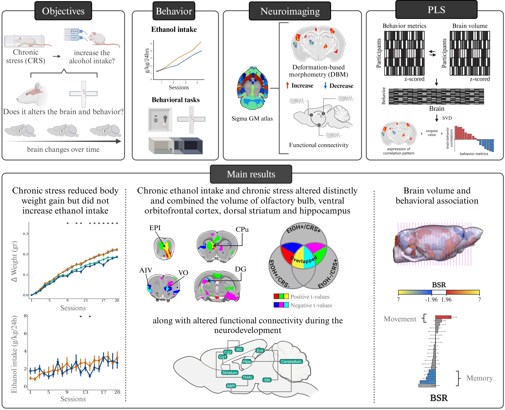

# Sudmex-alcohol-stress
---

 

   

---

## Peer-reviewed report

The effect of chronic stress and chronic alcohol intake on behaviour, brain volume, and functional connectivity in a longitudinal rat model 

[https://doi.org/10.1093/braincomms/fcaf432](https://doi.org/10.1093/braincomms/fcaf432)

## Summary

We conducted an in vivo longitudinal rat model with three main goals. 1) to determine if chronic stress increases ethanol intake; 2) to determine the effect of chronic- stress and ethanol intake in behavioural measures, brain structure, and function; and 3) to investigate the effect of sex. This observational study included Wistar rats assigned to four groups: 1) ethanol consumption (EtOH+/CRS−), 2) stress exposure (EtOH−/CRS+), 3) both ethanol and stress exposure (EtOH+/CRS+), and 4) control group (EtOH−/CRS−). 

---

## Steps

[1. Environment installation](https://github.com/psilantrolab/Sudmex-alcohol-rat/blob/main/code/Env_configuration.md)   

[2. Alcohol consumption pattern](https://github.com/psilantrolab/Sudmex-alcohol-rat/blob/main/code/Alcohol_consumption.ipynb)

[3. Behavioral metrics](https://github.com/psilantrolab/Sudmex-alcohol-rat/blob/main/code/Behavior_metrics.ipynb)

[4. MRI metrics](https://github.com/psilantrolab/Sudmex-alcohol-rat/blob/main/code/MRI_metrics.ipynb)

[5. Partial least square analysis](https://github.com/psilantrolab/Sudmex-alcohol-rat/blob/main/code/PLS.ipynb)

[6. Manuscript figures](https://github.com/psilantrolab/Sudmex-alcohol-rat/blob/main/code/Figures.ipynb)

---

Links

[About me](https://scholar.google.com/citations?user=VrNwDBQAAAAJ&hl=es)
